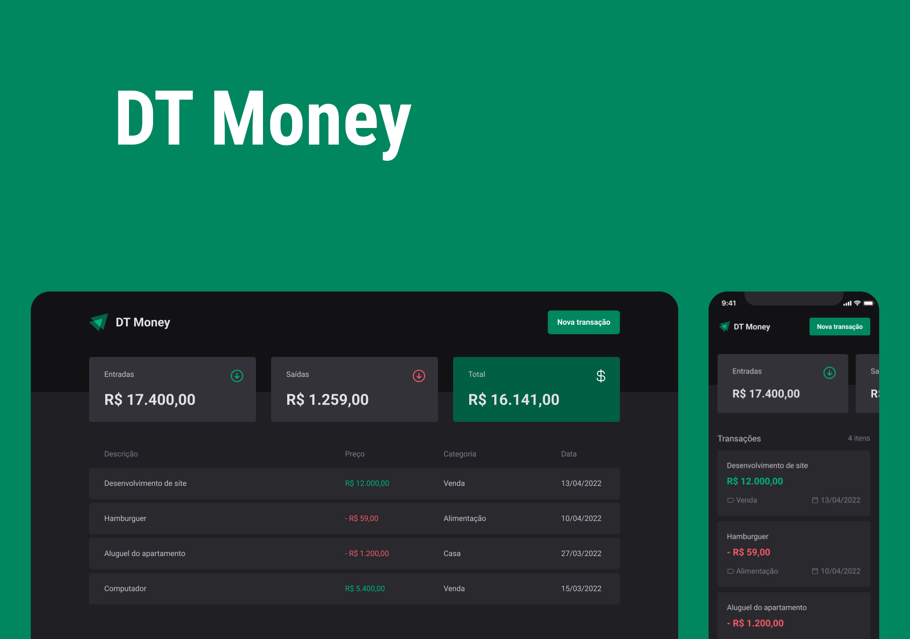

<h1 align="center">
  
</h1>

<h1 align="center">
  
</h1>

# Sobre o projeto

<p>
  DT Money Black é um aplicativo web para controle financeiro pessoal, onde é possível criar uma nova transação, seja uma saída ou uma entrada. O cálculo é feito instantaneamente em tela para mostrar ao usúario nos cards e abaixo é listado todas as transações. Também é possível filtar por transações. Nesse projeto foi abordado as melhores práticas para acessibilidade e performance.
</p>

# Tecnologias

- [Vite](https://vitejs.dev/)
- [ReactJs](https://reactjs.org/)
- [TypeScript](https://www.typescriptlang.org/)
- [Phosphor React](https://github.com/phosphor-icons/phosphor-react)
- [Zod](https://zod.dev/)
- [React Hook Form](https://react-hook-form.com/)
- [Styled-components](https://styled-components.com/)
- [Radix UI](https://www.radix-ui.com/)
- [json-server](https://www.npmjs.com/package/json-server)

## Como baixar o projeto

```bash
# Clonar o repositório
$ git clone https://github.com/wellingtonrodriguesbr/dt-money-black.git

# Entrar no diretório
$ cd dt-money-black

# Instalar as dependências
$ npm install

# Rodar o json-server
$ npm run dev:server

# Rodar o projeto
$ npm run dev
```

<br/>
<hr/>

<p align="center">Desenvolvido por <a href="https://www.linkedin.com/in/wellingtonrodriguesbr/" target="_blank">Wellington Rodrigues</a> ✌🏽</p>
